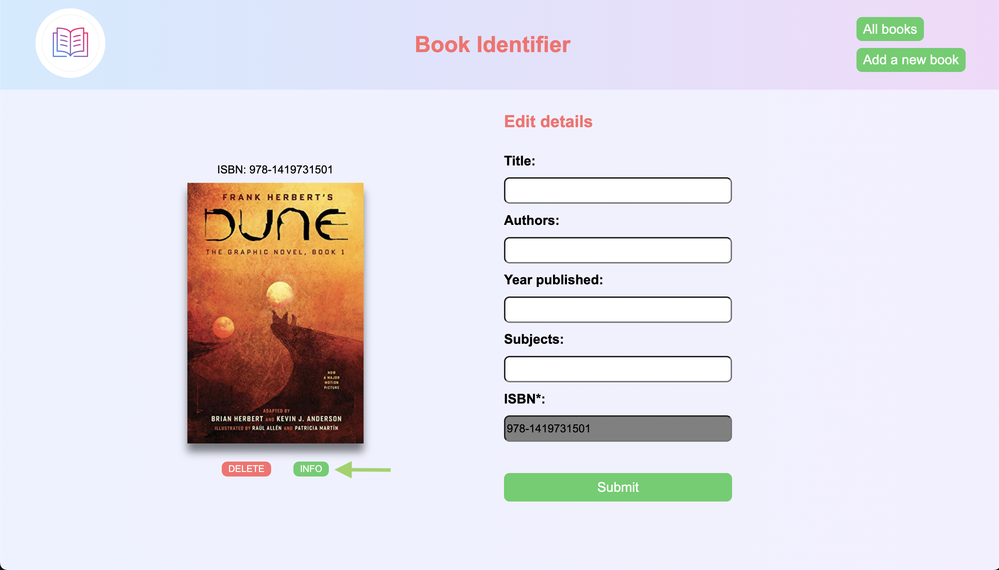
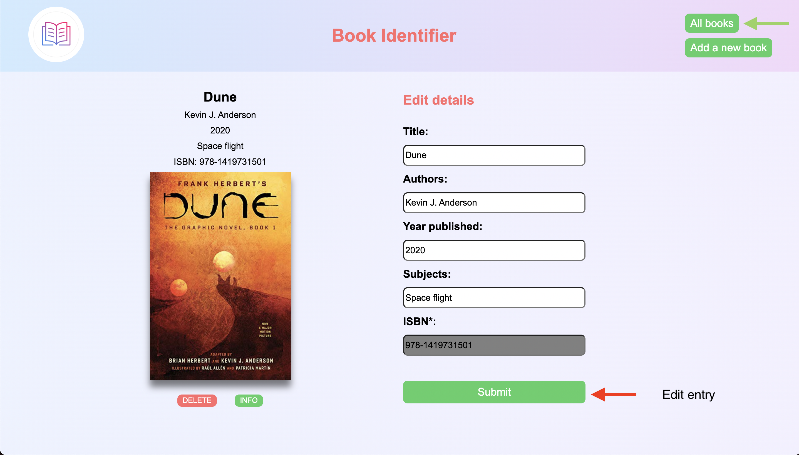

# [Book Identifier Application](https://book-identifier.netlify.app/) (https://book-identifier.netlify.app/) | NodeJS, MongoDB, Mongoose, Express

---

We all struggle with accruing many books over the course of our lifetimes. If you are like me, you also struggle to remember what books you even have on your bookshelf.
In light of this, I have created a book identifier application. One method would be to input your book details manually into a book directory so that you have a record of what is on your bookshelf. However, manually inputting hundreds of entries is completely time consuming. Not to mention if you wanted to also add the book cover and futher metadata such as the subject of the book to the directory.
Well, this book identifier solves both of these problems by automating the entire sourcing of all of your book details in just one click!

## Features

This project has the following features:

1. A homepage index directory of all books you currently own that have previously been added via the identifier. Here, you can navigate to the 'Add a new book' button to add a new book entry.

   

2. Upon clicking on 'Add a new book', the user will be taken to a page with one sole input field - the ISBN number, which can be found on the back of the book itself, or on amazon.
   This ISBN number acts as the unique identifier for the book in question and is the only information you will ever have to add.

   

3. By inputting the ISBN number of a book, the application will make a call to the [OpenLibrary API](https://openlibrary.org/developers/api), where it will first return the book cover of the book in question.

   

4. If the book cover is correct, you can then click the 'info' button below the cover, which will then make a second call to the [OpenLibrary API](https://openlibrary.org/developers/api), this time grabbing the rest of the book information including the title, author, year, and genre of the book. You can also click on the title or the author, which links you to the openlibrary webpage for that book or author in question for more information, or for similar books. Furthermore, you have the option to manually edit the book details yourself.
   If the book cover is incorrect, you can delete the book and try another isbn number from another source.

   

5. Then, as you navigate back to the 'all books' index directory, you will see your book entry added to the directory.

   

# Final comments

To try it out for yourself [click here](https://book-identifier.netlify.app/).
If you have any questions or suggestions, reach out to me at vivekbadiani@gmail.com!
